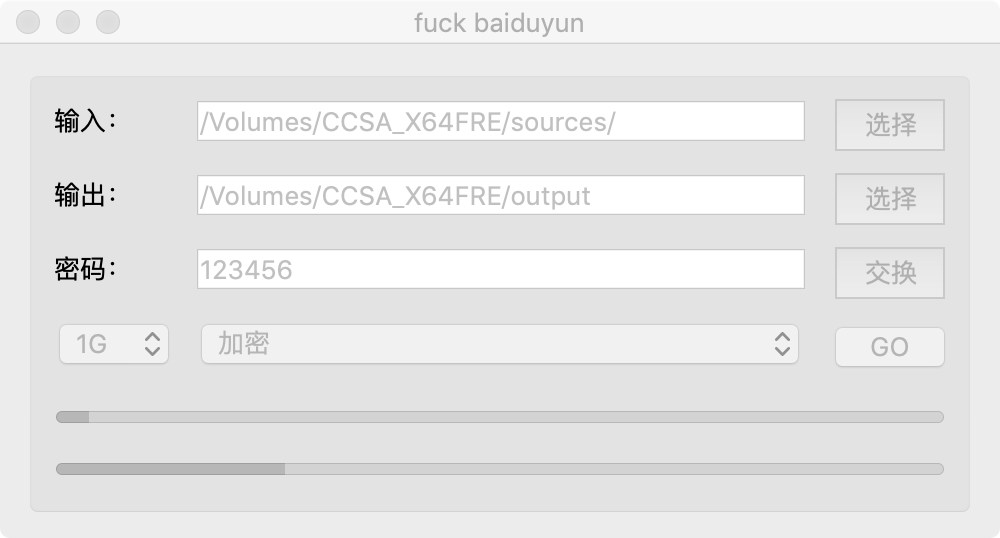
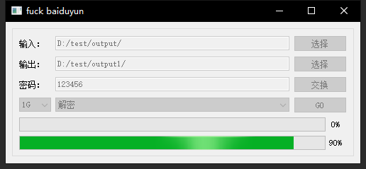

# fuckbaiduyun
百度网盘快速加解密工具

## 特性
1. go+qt实现跨平台，目前有mac、windows版本
2. 单文件进行加密，目录结构维持不变，方便单独浏览下载
3. rc4按块加密文件，防止文件被和谐
4. 自动拆分文件，适应百度网盘限制
5. 单线程执行，不耗尽系统资源
6. 进度条显示
7. 保存上次选项
8. 只对输出目录写操作，保证输入目录安全
9. 加解密的进度保存，可从断点继续
10. 加密文件会再与原文件比对保证数据安全

## 用法
1. 打开程序
2. 选择输入路径
3. 选择输出路径
4. 输入密码
5. 选择切分文件大小
6. 点击GO运行

## 下载
https://github.com/esrrhs/fuckbaiduyun/releases

## 示例

