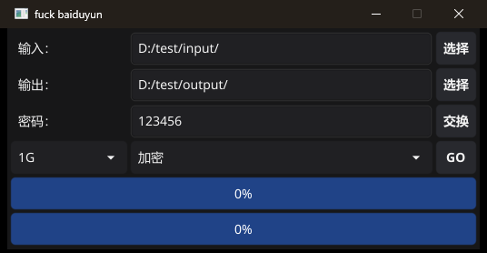

# fuckbaiduyun

[](https://github.com/esrrhs/fuckbaiduyun)
[](https://github.com/esrrhs/fuckbaiduyun)
[](https://github.com/esrrhs/fuckbaiduyun/releases)
[](https://github.com/esrrhs/fuckbaiduyun/releases)
[](https://github.com/esrrhs/fuckbaiduyun/actions)

百度网盘本地加解密工具。按文件加密、保持目录结构，并可按大小自动拆分，避免上传时被和谐或触发体积限制。

界面用 Go + [Fyne](https://fyne.io/) 实现，支持 Windows、macOS、Linux。加密格式与旧版本兼容，以前生成的 `.fuckbaiduyun` 文件仍可解密。当前版本见 `version.go`。

## 特性

- 单文件加密，输出目录结构与输入一致，方便单独浏览、下载
- 按 1MB 块做 RC4 加密
- 可按 1G / 4G / 10G / 20G 自动拆分，适应网盘限制
- 单线程处理，不占满系统资源
- 任务进度、当前文件进度分开显示
- 记住上次的目录、密码、加密/解密和切分选项
- 只写输出目录，不改动输入文件
- 中断后可从进度文件继续
- 加密完成后回读校验，确认与原文一致

## 用法

1. 打开程序
2. 选择输入目录、输出目录
3. 填写密码
4. 选择切分大小，以及加密或解密
5. 点击 GO

加密结果为 `原文件名.fuckbaiduyun`，超出切分大小时继续生成 `.0`、`.1` … 分片。解密时选中加密文件所在目录即可，分片会自动拼接。

「交换」会互换输入/输出路径，并在加密、解密之间切换。

## 构建

需要 Go 1.25+ 和 C 编译器。Windows 可用 MSYS2 gcc。

```bash
# Windows：必须加 -H windowsgui，否则会弹出控制台黑框
go build -ldflags="-H windowsgui" -o fuckbaiduyun.exe .

# macOS / Linux
go build -o fuckbaiduyun .
```

```bash
go test ./...
```

## 发布

版本号写在 `version.go` 的 `Version`。把它改成一个还没发过的号（如 `2.0.1`）并推到 `master` 后，GitHub Actions 会：

1. 对比该版本是否已有 GitHub Release
2. 没有则分别在 Windows / macOS / Linux 上编译打包
3. 自动创建 `v版本号` 的 Release 并上传三个平台的压缩包

同一版本号重复推送不会再发。也可在 Actions 里手动跑 `Release` 工作流。

## 下载

https://github.com/esrrhs/fuckbaiduyun/releases

## 示例


